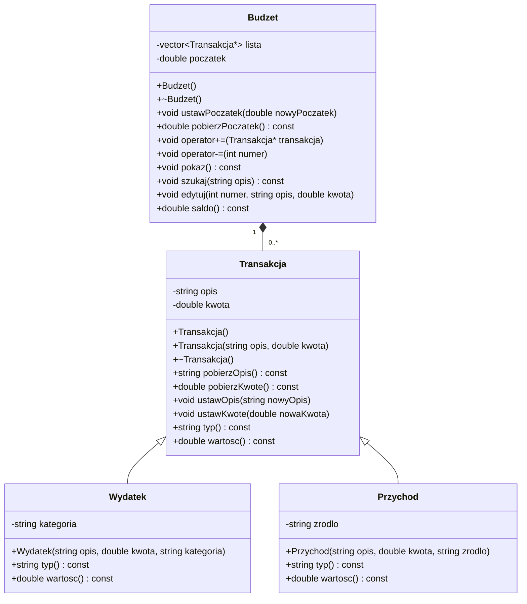

```mermaid
classDiagram
class Transakcja {
-string opis
-double kwota
+Transakcja()
+Transakcja(string opis, double kwota)
+~Transakcja()
+string pobierzOpis() const
+double pobierzKwote() const
+void ustawOpis(string nowyOpis)
+void ustawKwote(double nowaKwota)
+string typ() const
+double wartosc() const
}
class Wydatek {
-string kategoria
+Wydatek(string opis, double kwota, string kategoria)
+string typ() const
+double wartosc() const
}
class Przychod {
-string zrodlo
+Przychod(string opis, double kwota, string zrodlo)
+string typ() const
+double wartosc() const
}
class Budzet {
-vector~Transakcja*~ lista
-double poczatek
+Budzet()
+~Budzet()
+void ustawPoczatek(double nowyPoczatek)
+double pobierzPoczatek() const
+void operator+=(Transakcja* transakcja)
+void operator-=(int numer)
+void pokaz() const
+void szukaj(string opis) const
+void edytuj(int numer, string opis, double kwota)
+double saldo() const
}
Transakcja <|-- Wydatek
Transakcja <|-- Przychod
Budzet "1" *-- "0..*" Transakcja
```
